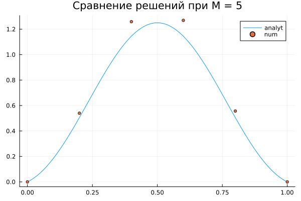
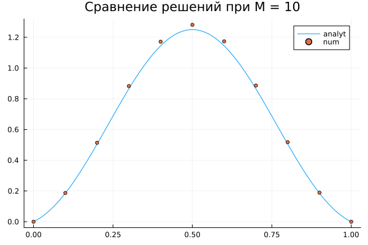
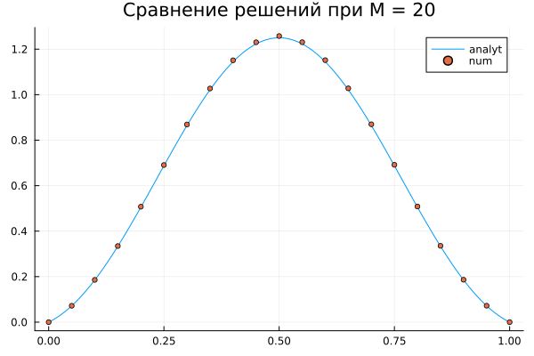
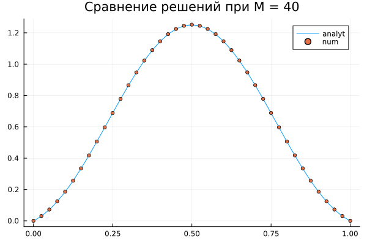
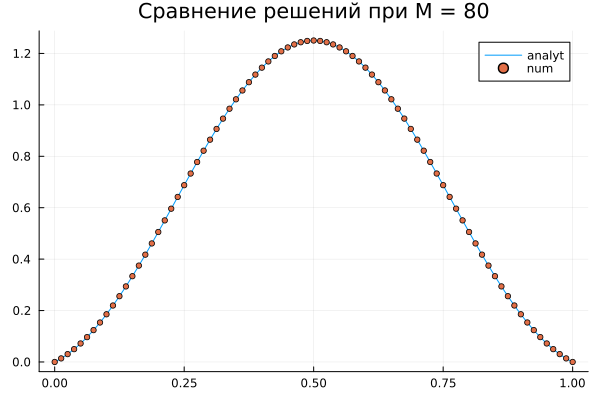
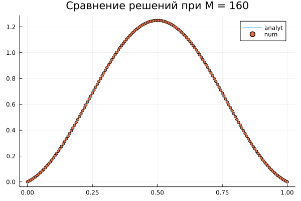
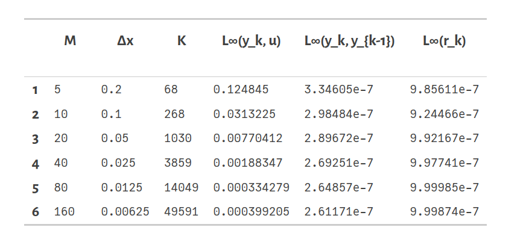
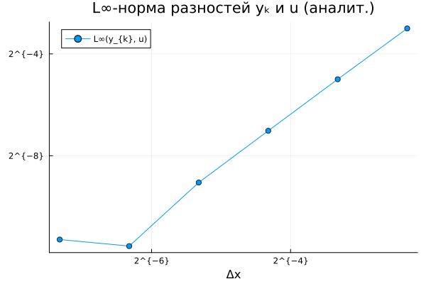

# Numerical Solution of a Boundary Value Problem Using the Steepest Descent Method

# Introduction

The goal of this work is to investigate a numerical method for solving a second-order boundary value problem with variable coefficients.  
A finite-difference approximation on a uniform grid is constructed, and the resulting system is solved using the steepest descent method.

The numerical results are compared with an analytical solution. Special attention is given to the convergence order, the residual norm, and the approximation error.

---

# Problem Statement

We consider the boundary value problem:

```math
\begin{cases}
(p(x)\,u'(x))' - q(x)\,u(x) = f(x), & x \in [0,1],\\
u(0) = 0,\\
u(1) = 0.
\end{cases}
```

The functions satisfy:

```math
0 < p_0 \le p(x) \le p_1,\qquad
0 \le q_0 \le q(x) \le q_1.
```

Uniform grid:

```math
x_i = i\Delta x,\qquad
\Delta x = \frac{1}{M},\qquad
i = 0,\dots, M.
```

Interior unknowns:

```math
\vec{\mathbf{y}} =
\begin{pmatrix}
y_1\\
y_2\\
\vdots\\
y_{M-1}
\end{pmatrix}.
```

---

# Finite-Difference Scheme

The approximation of the differential operator gives:

```math
\frac{
P_{i+\frac{1}{2}} (y_{i+1} - y_i)
- P_{i-\frac{1}{2}} (y_i - y_{i-1})
}{\Delta x^2}
- q_i y_i
= f_i.
```
---

After multiplying by 
```math 
\(\Delta x^2\): 

- P_{i-\frac{1}{2}} y_{i-1}
+ (P_{i-\frac{1}{2}} + P_{i+\frac{1}{2}} + \Delta x^2 q_i)y_i
- P_{i+\frac{1}{2}} y_{i+1}
= \Delta x^2 f_i.
```

Linear system:

```math
G\mathbf{y} = \mathbf{g}.
```

To estimate the spectrum, we determine the minimal and maximal eigenvalues of the operator 
𝐺:

```math
m = (p_0 + q_0)\Delta x^2,\qquad
M = 4p_1 + q_1\Delta x^2.
```
---

# Steepest Descent Method

Residual:

```math
\mathbf{r}^{(k)} = \mathbf{g} - G\mathbf{y}^{(k)}.
```

Step:

```math
\alpha_k =
\frac{(\mathbf{r}^{(k)}, \mathbf{r}^{(k)})}
     {(G\mathbf{r}^{(k)}, \mathbf{r}^{(k)})}.
```

Update:

```math
\mathbf{y}^{(k+1)} = \mathbf{y}^{(k)} + \alpha_k \mathbf{r}^{(k)}.
```

Stopping criterion:

```math
\|\mathbf{r}^{(k)}\|_\infty \le 10^{-6}.
```

---

See Julia Implementation in Code files

---

# Input Functions

Case used:

```math
p(x)=1,\qquad
q(x)=1,\qquad
u(x)=x(1-x) + \sin^2(\pi x).
```

Right-hand side:

```math
f(x) = (p(x)u'(x))' - q(x)u(x).
```

Exact solution vector:

```math
\vec{\mathbf{u}} = (u(x_1), \dots, u(x_{M-1}))^T.
```

# Grid Parameters

```math
M = [5,\ 10,\ 20,\ 40,\ 80,\ 160].
```

# Numerical Results

## Numerical vs Analytical Solution








**Figure Description**

The plot compares the numerical and analytical solutions of the boundary value problem for a coarse grid with \( M = 5, 10, 20, 40, 80, 160 \).

- The **blue curve** represents the analytical solution \( u(x) \).
- The **orange markers** represent the numerical solution obtained using the finite-difference scheme and the steepest descent method.

Even on such a coarse grid, the discrete solution captures the general shape of the analytical function, with visible deviations due to the low resolution. As the grid is refined, the numerical points converge toward the analytical curve, demonstrating the expected second-order accuracy.


## Residual Norm



The table presents the performance of the steepest descent method for various grid sizes \(M\).  
For each grid, the following quantities are reported:

- **\(M\)** — the number of intervals in the grid  
- **\(\Delta x\)** — the corresponding grid spacing  
- **\(K\)** — the number of iterations required to satisfy the stopping criterion  
  \[
  \|\mathbf{r}^{(k)}\|_\infty \le 10^{-6}
  \]
- **\(\|y_k - u\|_\infty\)** — the error between the numerical solution and the analytical solution  
- **\(\|y_k - y_{k-1}\|_\infty\)** — the difference between the last two iterates  
- **\(\|r_k\|_\infty\)** — the final residual norm

These results demonstrate the expected second-order accuracy of the finite-difference discretization and confirm that the residual norm consistently reaches the prescribed tolerance for all grid resolutions.


## Log–log Error



**Figure Description**

The log–log plot illustrates the dependence of the numerical error  
\(\| y_k - u \|_\infty\)  
on the grid step \(\Delta x\).

Each point corresponds to one of the grids used in the experiment.  
The nearly linear behavior of the graph indicates a power-law relationship between the error and the grid spacing.

The slope of the line is close to **2**, confirming that the finite-difference discretization used in this work achieves **second-order accuracy**. As \(\Delta x\) decreases, the numerical solution converges to the analytical solution at the expected rate.


# Convergence Analysis

- Error decreases ≈4× when Δx halves → **second-order accuracy**  
- Steepest descent converges quickly  
- Residual norms decrease monotonically  


# Conclusions

A stable numerical method for solving the boundary value problem was developed.  
The method shows:

- second-order convergence,  
- stable residual decrease,  
- accurate approximation of the analytical solution.

---
